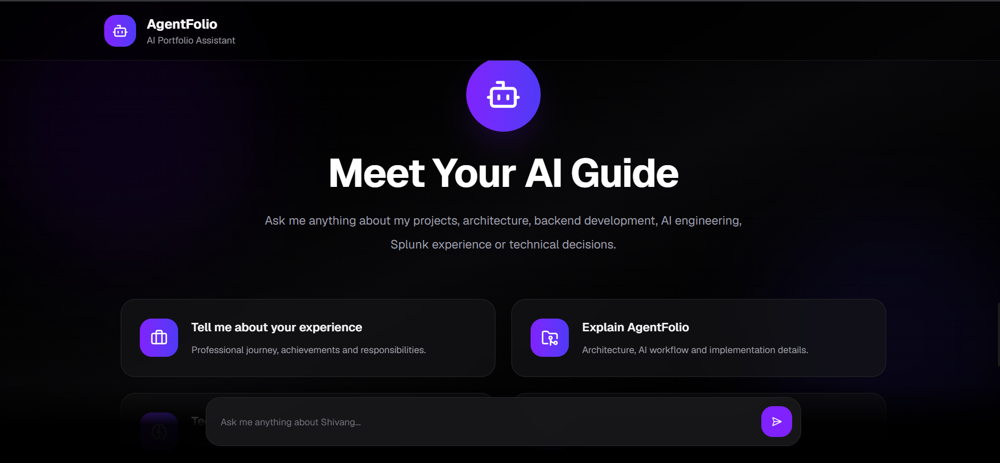

# AgentFolio Backend

AgentFolio Backend is a Spring Boot application that powers an AI-driven portfolio assistant. Instead of a traditional portfolio website, it enables developers to deploy a personalized AI agent capable of answering recruiter and interviewer questions based on their skills, experience, projects, and portfolio.

The backend is designed with a modular architecture, supports real-time AI response streaming using Server-Sent Events (SSE), and is easily configurable through external configuration files.

---
## Demo

[](https://drive.google.com/file/d/1R_eVEwVYqaUGhGzN_t4QhQ2T7sIKT_WD/view?usp=sharing)

The demo covers:

- Project overview
- Backend architecture
- Package structure
- Configuration setup
- Live AI chat
- Real-time response streaming
- AWS EC2 deployment


## Features

- AI-powered portfolio assistant
- Real-time streaming responses using Server-Sent Events (SSE)
- Config-driven personalization
- External Markdown-based knowledge base
- Modular and extensible architecture
- RESTful APIs
- Self-hostable and cloud-ready
- Easy integration with modern frontend applications

---

## Tech Stack

- Java 21
- Spring Boot 3
- Spring AI
- Maven
- Server-Sent Events (SSE)
- OpenRouter / OpenAI Compatible APIs

---

## Architecture

The backend follows a layered architecture where each component has a well-defined responsibility.

```
Client
   │
   ▼
REST Controller
   │
   ▼
Chat Service
   │
   ▼
Prompt Builder
   │
   ▼
Knowledge Base + AI Provider
   │
   ▼
Streaming Response (SSE)
```


---

## Configuration

The application loads user-specific configuration from an external directory specified using the `AGENT_CONFIG_PATH` environment variable.

Example:

```
agentfolio/
├── portfolio.md
└── agent-config.yaml
```

---

## Running Locally

Clone the repository

```bash
git clone <repository-url>
```

Build the project

```bash
mvn clean install
```

Run the application

```bash
java -jar target/*.jar
```

---

## API

### Chat Endpoint

```
POST /api/chat
```

The endpoint accepts a user message and streams the AI-generated response using **Server-Sent Events (SSE)**, providing a smooth, real-time conversational experience.

---
